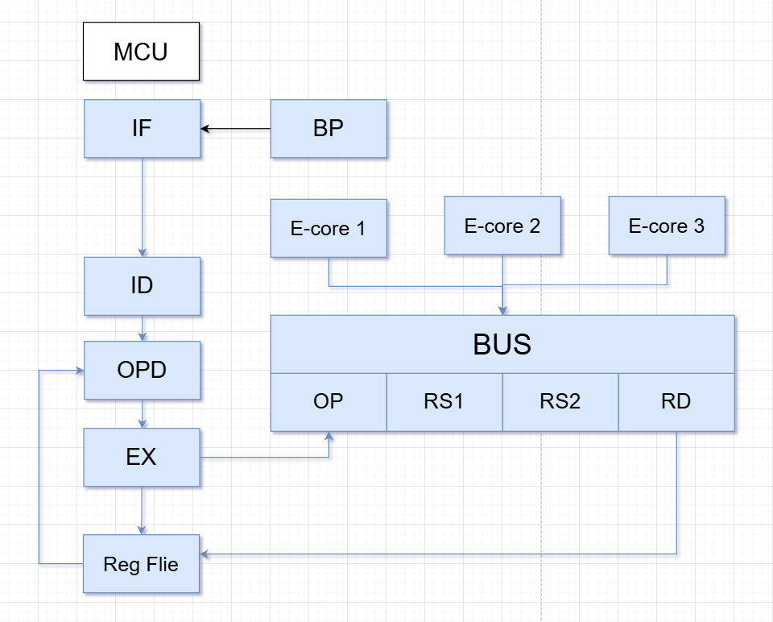

# RVX_Open_MCU.risc-v
## English
this is an open-source MCU project. We aim to develop a microcontroller unit from scratch,  Its instruction set is RISC-V

## Here’s our idea for a custom MCU design

We're thinking about building our own MCU from scratch.
The cool part is you can extend its bus right onto the PCB and plug in whatever extra compute modules you want.

## Here’s the rough design we sketched out:

Some of the features we have in mind:

Branch prediction using a simple 2-bit saturating counter

4-stage pipeline:

Fetch

Decode

Get operands

Execute / Push result to bus

The bus is kept lean—either commands are packed tight or sent in timeslots to save pins/wires.

## 中文
这是一个开源的微控制器项目。我们的目标是从零开发一个微控制器单元，它的指令集是RISC-V

## 这是我们针对定制 MCU 设计的想法!

我们正在考虑从零开始打造自己的微控制器。
很拽的是，你可以把它的总线直接延伸到PCB上，并插入你想要的任何额外计算模块。

## 这是我们初步勾画的设计:

我们设想的一些功能:

使用简单的 2 位饱和计数器进行分支预测

四级流水线：
1.取指
2.解码
3.获取操作数
4.执行 / 将结果推送到总线

总线保持精简——命令要么紧密打包，要么分时发送以节省引脚/线路。
